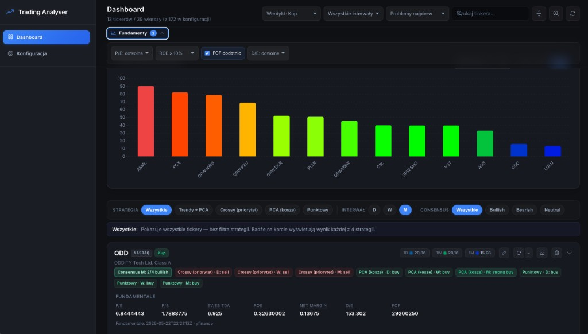

# Trading Analyser

Zestaw do automatycznego odczytu wskaźników z wykresów **TradingView** (PCA, HTS Panel, MacD) oraz **fundamentali** (P/E, P/B, EV/EBITDA, ROE, Net Margin, D/E, FCF) z przeglądaniem w **panelu web**. Skrypt `tv_scraper.py` korzysta z **Playwright** i podłącza się do już uruchomionej przeglądarki (Brave / Chrome) w trybie zdalnego debugowania (CDP). Aplikacja **FastAPI** (`app.py`) serwuje REST API i statyczny **dashboard** — zawsze wszystkie tickery z konfiguracji, wykres wielu metryk, odświeżanie per wskaźnik i konfiguracja scrapera.

## Zrzuty ekranu



*Panel dashboardu: composite score, filtry fundamentalne (P/E, P/B, EV/EBITDA, ROE itd.) oraz wykres wielu metryk w czasie.*


## Wymagania

- Python 3.10+ (w projekcie często używane jest środowisko wirtualne `venv`)
- **Brave** lub **Chrome** uruchomiony z portem debugowania **9222**
- Otwarta karta z **TradingView** (wykres), gdy działa scraper
- Zależności: `pip install -r requirements.txt` (w tym **yfinance** do fundamentów, **Playwright** do scrapera)

## Szybki start

```bash
cd /ścieżka/do/trading_analyser
python3 -m venv venv
source venv/bin/activate   # Windows: venv\Scripts\activate
pip install -r requirements.txt
playwright install chromium
```

### Uruchom aplikację (panel + API)

Najprościej:

```bash
./scripts/start_app.sh
```

Otwórz panel w przeglądarce: `http://127.0.0.1:8000`

### Scraper i przeglądarka (CDP / remote debug)

Scraper łączy się do Brave/Chrome przez CDP na porcie **9222**.

Gdy uruchamiasz scraper z panelu (`/api/scraper/run`), aplikacja **automatycznie odpala Brave/Chrome** z CDP na macOS jeśli port 9222 nie odpowiada — domyślnie **z Twoim systemowym profilem Brave/Chrome**, czyli z już zalogowanym TradingView, zapisanymi zakładkami itp.

Jak to działa krok po kroku (na macOS):

1. Klikasz w panelu „Uruchom” / „Odśwież brak danych”.
2. Aplikacja sprawdza `http://127.0.0.1:9222`.
3. Jeśli CDP nie działa — uprzejmie zamyka Brave (Cmd+Q przez AppleScript). Sesja kart zostaje zapisana — Brave ją odtworzy.
4. Aplikacja uruchamia Brave ponownie z `--remote-debugging-port=9222 --user-data-dir=<Twój profil>` i otwiera `https://www.tradingview.com/chart/`.
5. Scraper łączy się przez CDP — TV jest już zalogowany, brak reklam dla niezalogowanych.

#### Konfiguracja w `scraper_config.json`

```json
"cdp_port": 9222,
"auto_start_cdp_browser": true,
"cdp_browser_preference": "brave",         
"cdp_use_system_profile": true,            
"cdp_auto_quit_browser": true,             
"cdp_user_data_dir": "",                    
"cdp_startup_url": "https://www.tradingview.com/chart/"
```

Najczęściej zmieniane:

- `cdp_use_system_profile: false` → użyj **dedykowanego** profilu (`data/.cdp-profile/`). Wymaga jednorazowego logowania do TV.
- `cdp_auto_quit_browser: false` → nie zamykaj automatycznie Brave; sam dbasz o to, żeby Brave nie działał, gdy włączasz scraper.
- `cdp_user_data_dir: "/ścieżka/do/profilu"` → ręczny override.

Możesz też wymusić ENV: `TV_AUTO_START_CDP=0` (wyłącz auto-start) / `TV_AUTO_START_CDP=1` (włącz).

Jeśli chcesz uruchomić przeglądarkę ręcznie, użyj jednej z opcji poniżej.

### Brave (macOS)

```bash
/Applications/Brave\ Browser.app/Contents/MacOS/Brave\ Browser --remote-debugging-port=9222
```

Otwórz w tej sesji kartę z wykresem TradingView. Bez tego scraper zgłosi brak połączenia lub brak karty TV.

### Google Chrome (macOS)

```bash
/Applications/Google\ Chrome.app/Contents/MacOS/Google\ Chrome --remote-debugging-port=9222
```

### Skróty (macOS) — uruchomienie jednym poleceniem

CDP (Brave/Chrome) na porcie 9222:

```bash
./scripts/start_browser_debug.sh
```

Start aplikacji (uvicorn):

```bash
./scripts/start_app.sh
```

## Panel web — funkcjonalność

Dashboard pokazuje **zawsze wszystkie tickery z konfiguracji** — bez wyboru daty z sidebara. Dla każdego tickera backend (`GET /api/dashboard`) łączy najnowszy wiersz per interwał (`1D` / `1W` / `1M`) z historycznych plików `results/tradingview_results_*.csv`, dołącza `Last_Refresh` (data pliku źródłowego) oraz fundamentale z `results/fundamentals.csv`.

### Karty tickerów (widok główny)

Dla każdego tickera generowana jest karta z ikonami akcji po prawej stronie nagłówka:

- 🔄 **odśwież** — zleca ponowne pobranie techniki (`POST /api/scraper/run`) **oraz** fundamentów (`POST /api/fundamentals/refresh`) dla tego tickera.
- ▼ **menu odświeżania** (obok 🔄) — sam wskaźnik: **PCA**, **HTS Panel** lub **MacD** (`POST /api/scraper/run` z `indicators`); szybsze niż pełny rescrape.
- 🕘 **historia** — modal z wykresem historycznym wybranego wskaźnika (PCA, MacD Line/Histogram, Fund P/E, P/B, EV/EBITDA, ROE, FCF) dla interwału `1D` / `1W` / `1M` (fundamentale bez filtra interwału).
- ✏️ **zmiana nazwy** — modal do zmiany symbolu tickera w konfiguracji.

Każda karta zawiera:

- sekcję **Fundamentale** (P/E, P/B, EV/EBITDA, ROE, Net Margin, D/E, FCF) — wspólna dla całej karty; najedź na etykietę wskaźnika, aby zobaczyć krótki opis (tooltip),
- trzy kolumny interwałów z sekcjami HTS / MacD / PCA,
- **`Ostatnio: …`** per interwał (timestamp `Last_Refresh`).

Karta jest podświetlona na czerwono, gdy żaden interwał nie był odświeżany dłużej niż **24 h**.

Na górze widoku:

- **Filtr interwału** — `1D` / `1W` / `1M` / wszystkie.
- **Pasek wyszukiwania** — filtrowanie po tickerze / nazwie spółki.
- **Sortowanie** — domyślnie „Problemy najpierw", plus PCA, MacD Line, P/E, ROE, FCF, consensus, **werdykt composite (Kup first)**, **composite score ↓** i ticker A→Z.
- **Werdykt composite** — badge **Kup** / **Obserwuj** / **Unikaj** na karcie (40% fundamenty, 40% scoring 1W, 20% consensus D/W/M); tooltip z breakdown. Filtr `#verdict-filter` w nagłówku.
- **Filtry fundamentalne** — P/E max, ROE min, FCF dodatnie, D/E max (client-side, `localStorage`).
- **Wykres dashboardu** — dropdown metryki (PCA, MacD Line/Histogram, HTS Fast/Slow High, fundamentale); filtr interwału `1D` / `1W` / `1M` (ukryty dla metryk `Fund_*`). Gdy brak punktów dla wybranej metryki, panel pokazuje **komunikat pustego stanu**, ale **sterowanie (dropdown + interwał) pozostaje widoczne**.

Diagnostyka braków wskaźników: `/api/results/{date_id}` i `/api/dashboard` zwracają `Missing_Indicators` oraz `All_Indicators_Missing`.

### Zmiana nazwy tickera (`POST /api/tickers/rename`)

- Walidacja symbolu przez regex `^[A-Z0-9._:\-]{1,24}$` (obsługuje prefix giełdy, np. `GPW:ATC`).
- Fuzzy match starej nazwy: najpierw **dokładne trafienie**, potem **bazowy symbol** (prefiks przed pierwszą kropką, np. `LULU.O` ↔ `LULU`) i bezpieczny wariant bez prefixu giełdy (`ATC` ↔ `GPW:ATC`). Jeśli karta pochodzi ze starego CSV i tickera nie ma już w configu (np. `DIAP`, a w configu jest `GPW:DIA`), endpoint zwraca `404` z tym samym formatem kandydatów, którego używa `/api/results`. UI pokazuje wtedy czytelny komunikat i przy jednym kandydacie przycisk „Użyj ...".
- CSV-y historyczne **nie są modyfikowane** (stare wiersze zostają jako audyt).
- W UI stara karta jest ukrywana w `localStorage`, żeby reload jej nie przywrócił; przyciskiem „(pokaż)" przy liczniku rekordów można przywrócić ukryte symbole. Backend dokleja też do wyników pola `In_Config`, `Config_Match`, `Config_Status` i `Config_Candidates`, żeby łatwiej odróżnić symbol z historycznego CSV od aktualnej konfiguracji.
- Gdy karta z CSV nie istnieje w aktualnym `scraper_config.json`, panel pokazuje baner „Stary symbol z CSV" / „Symbol z CSV nie jest w konfiguracji". Przy jednym kandydacie z configu akcja **„Użyj <ticker>"** ukrywa starą kartę i odpala ponowne pobranie poprawnego symbolu; bez kandydata dostępne jest **„Ukryj z widoku"**.

### Trwałe usuwanie tickera z historii

Na karcie tickera jest przycisk kosza. To nie jest zwykłe ukrycie: UI najpierw woła `GET /api/tickers/{ticker}/delete_preview`, pokazuje ile wpisów jest w configu oraz ile wierszy w ilu historycznych CSV zostanie usuniętych, a dopiero potem `DELETE /api/tickers/{ticker}` trwale:

- usuwa dokładny ticker z `scraper_config.json` (case-insensitive),
- przepisuje wszystkie `results/tradingview_results_*.csv`, wycinając wiersze tego tickera,
- zostawia pliki CSV i nagłówki na miejscu, nawet jeśli po usunięciu plik jest pusty.

Ta operacja usuwa historię PCA/sygnałów dla danego symbolu. Jeśli chcesz tylko posprzątać widok w swojej przeglądarce, użyj „Ukryj z widoku" przy banerze starego symbolu.

### Zakładka „Konfiguracja"

- **Tickery** — dodawanie / usuwanie symboli (walidacja po regexie jak wyżej).
- **Interwały** i **wskaźniki** — checkboxy.
- **Auto-schedule** — codzienny przebieg o ustawionej godzinie (APScheduler `CronTrigger`).
- **`run_on_startup`** — **domyślnie wyłączone** (patrz niżej sekcję o harmonogramie).
- Przyciski **„Uruchom wszystkie"** i **„Zatrzymaj"** — Uruchom potwierdza akcją w własnym modalu (natywne `confirm()` bywa wyciszane przez przeglądarki po „nie pokazuj kolejnych okien dialogowych"). Stop zabija całą grupę procesów scrapera (SIGTERM → SIGKILL) + fallback przez `pgrep -f tv_scraper.py` dla osieroconych procesów po restarcie serwera.
- **Menu „Odśwież brak danych"** (▼) — pełny rescrape no-data tickerów albo tylko **PCA** / **HTS** / **MacD** (`no_data_only` + opcjonalne `indicators`).
- **„Odśwież fundamentale"** — masowe `POST /api/fundamentals/refresh` z `{all:true}` dla wszystkich tickerów z configu.
- **Pasek postępu scrapera** — odświeżany co ~1 s (`GET /api/scraper/status`), format **monotoniczny**: `15/78 · ticker 15/26 · wsk. 1/3 · PCA` (łączny licznik rośnie między fazami wskaźników; UI liczy procent z pierwszej frakcji `done/total`).
- **Modal „Wznów / Od nowa" po crashu lub Stop** — gdy poprzedni „Uruchom wszystkie" nie zakończył się czysto (proces padł albo użytkownik kliknął Stop), zostaje plik `scraper_state.json` z listą przetworzonych par `(ticker, interwał)` i ścieżką do bieżącego CSV. Kolejny klik **„Uruchom wszystkie"** najpierw woła `GET /api/scraper/pending_run`; jeśli wykryje pending state, UI pokazuje modal z trzema przyciskami:
  - **Wznów** — `POST /api/scraper/run {fresh:false}`, scraper kontynuuje z tym samym `current_file` (np. wczorajszym CSV) i pomija pary już z `state["processed"]`.
  - **Zacznij od nowa** — `POST /api/scraper/run {fresh:true}`, backend kasuje `scraper_state.json` przed startem podprocesu, więc scraper utworzy świeży `tradingview_results_<DZIŚ>.csv`.
  - **Anuluj** — no-op.
  Heurystyka: gdy state ma >1 h (`os.path.getmtime`), default focus pada na „Zacznij od nowa" (zwykle user zapomniał o starym runie); inaczej na „Wznów". Dla partial run (konkretne tickery / subset wskaźników) i dla `no_data_only` flaga `fresh` jest ignorowana — te tryby nie używają resume i nie ruszają state'u. Po zakończeniu runu UI przeładowuje **dashboard** (`GET /api/dashboard`).

### Watchlista (zakładka „Watchlist")

Jeśli w `data/` jest plik `Portfel_Watchlist_*.csv`, panel dołącza do tickerów pola: `Name`, `Last`, `Market_Cap`, `P/E`, `EPS`, `Beta`, `Revenue`, `Daily_Signal` / `Weekly_Signal` / `Monthly_Signal`, `Chg. %`, `YTD`, `1Y`. W widoku watchlisty można filtrować po sygnale (Strong Buy / Buy / Neutral / Sell / Strong Sell) i interwale — filtry pamiętają się w `localStorage`.

### Sygnał kup/sprzedaj (filtr po strategii)

Toolbar nad listą tickerów ma chipy ze strategiami liczenia sygnału z 3 wskaźników (PCA / HTS Panel / MacD). Wybór jednej strategii filtruje listę: pokazuje tylko tickery, które pod tą strategią dają sygnał **„buy" lub „strong buy"** dla wybranego interwału (D / W / M). Domyślnie **„Wszystkie"** = brak filtra.

- **Trendy + PCA** — 2× Wzrostowy + PCA ≥ 60 → Strong Buy; 2× Wzrostowy → Buy; 2× Spadkowy + PCA ≤ 40 → Strong Sell; 2× Spadkowy → Sell; reszta → Neutral.
- **Crossy (priorytet)** — BULL/BEAR CROSS z HTS/MacD przeważają nad trendem; PCA jako tie-breaker (≥60 buy, ≤40 sell). Fallback na trend jeśli brak crossów.
- **PCA (kosze)** — tylko PCA: ≤20 Strong Buy, 20–40 Buy, 40–60 Neutral, 60–80 Sell, ≥80 Strong Sell.
- **Punktowy** — HTS Trend (±1) + MacD Trend (±1) + PCA (≥60 ⇒ −1, ≤40 ⇒ +1). Suma w [−3..+3] mapowana na 5 koszyków.

Strategie liczone są w backendzie z surowych pól wskaźników i wystawiane jako kolumny `Computed_Signal_<id>` w odpowiedzi `/api/results/{date_id}`. UI używa ich do filtrowania i pokazywania bad-ży D/W/M na karcie tickera (gdy wybrana jest jedna strategia — pokazany jest jej sygnał; gdy „Wszystkie" — sygnały wszystkich 4). Wybór strategii i interwału pamięta się w `localStorage`.

Panel liczy też **consensus strategii** dla wybranego interwału: np. `3/4 bullish`, gdy trzy z czterech strategii dają `Buy` / `Strong Buy`, albo `2/4 bearish`, gdy przeważają `Sell` / `Strong Sell`. Consensus ma własne chipy filtrujące (`Bullish`, `Bearish`, `Neutral`) i opcje sortowania.

Pod toolbarem widać krótki opis aktualnie wybranej strategii. Jeśli filtr daje **0 tickerów** (np. trend_only przy spokojnym rynku), pokazuje się banner z podpowiedzią — to nie błąd, tylko stan rynku. W takiej sytuacji warto przełączyć interwał (D/W/M) lub strategię na bardziej liberalną (`pca_buckets` / `cross_priority`).

### Nazwa firmy obok tickera

Karta tickera w UI ma format `TICKER · Nazwa firmy` (np. `GDXJ · VanEck Junior Gold Miners ETF`). Nazwa pochodzi z trzech źródeł, w kolejności priorytetu:

1. Modal **Symbol Search** TradingView (otwierany przed wpisaniem tickera).
2. **Toolbar wykresu** / tytuł okna / opis legendy.
3. Publiczny endpoint **TV symbol-search REST** (`https://symbol-search.tradingview.com/symbol_search/v3/?text=...`) — używany jako fallback w scraperze i w `/api/results/{date_id}`. Wyniki są cache'owane lokalnie w `data/.company_names_cache.json` (negatywny cache 24h, żeby nie spamować API).

Dzięki temu, nawet jeśli scraper nie złapał nazwy z DOM-u (np. zmiany w TV), API może ją uzupełnić bez ponownego skrapowania. Cache leży poza repozytorium (gitignore).

### Naprawa symboli z prefixem giełdy

Niektóre tickery (np. polskie spółki z GPW) wymagają w TradingView prefixu giełdy — wpisanie samego `AMB` weźmie domyślnie pierwszy wynik (np. `MIL:AMB` z Mediolanu) zamiast `GPW:AMB`. W efekcie scraper widzi nie ten symbol co trzeba i wszystkie 3 interwały lądują jako **„Brak danych”**.

Aby to naprawić, w toolbarze nad listą tickerów jest przycisk **„Napraw symbole”** (ikona lupy z plusem). Pojawia się, gdy w dashboardzie są tickery z configu oznaczone jako **„Brak danych"** (`GET /api/tickers/no_data`). Po kliknięciu:

1. Backend (`GET /api/tickers/repair_no_data`) bierze listę no-data tickerów z configu.
2. Dla każdego bez `:` w nazwie odpytuje **TV REST symbol-search** i filtruje wyniki po polu `exchange` zgodnie z `exchange_prefixes` z `scraper_config.json` (domyślnie `["GPW"]`; kolejność = priorytet giełd).
3. UI pokazuje propozycje `OLD → NEW (opis spółki)` z checkboxami (radio gdy kilka giełd).
4. Przy braku dopasowania: **„Edytuj ręcznie"** — pole na symbol, np. `SSE:601088`.
5. Po zatwierdzeniu (`POST /api/tickers/repair_no_data`):
   - **„Zapisz naprawy"** — tylko renamy w `scraper_config.json` (z zachowaniem kolejności); scraper **nie** startuje automatycznie.
   - **„Zapisz i uruchom scraper"** — to samo + run `no_data_only` dla naprawionych symboli.

Aby rozszerzyć na inne giełdy, dopisz prefiksy w configu (kolejność = priorytet):

```json
"exchange_prefixes": ["GPW", "NYSE", "LSE"]
```

Wyniki TV REST są cache'owane w `data/.company_names_cache.json` pod kluczem `@matches:<TICKER>`, więc preview nie odpytuje serwera w kółko.

### Powiadomienia i skróty

- **Toasty** informują o starcie / zakończeniu scrapera, `already_running` (z informacją który ticker obecnie leci), sukcesie rename, błędach sieci.
- **Skróty klawiaturowe**: `/` — focus na wyszukiwanie, `Esc` — zamyka aktywny modal / czyści filtr.

### Sam skrypt (CLI)

```bash
python tv_scraper.py
```

Opcje: `--ticker A,B,C` (podzbiór), `--interval 1D`, `--indicators PCA,MacD` (subset wskaźników) — patrz `python tv_scraper.py -h`.

Konfiguracja domyślna jest w **`scraper_config.json`**. Kluczowe sekcje:

| Sekcja | Opis |
|--------|------|
| `tickers`, `intervals`, `indicators` | Lista symboli, interwały (`1D`/`1W`/`1M`), wskaźniki do scrapowania |
| `indicator_search` | Mapowanie nazwy w configu → fraza wyszukiwania TV, np. `"MacD": "CM_Ult_MacD_MTF"` |
| `fundamentals` | `enabled`, `cache_ttl_hours`, `tv_fallback` (GPW), lista pól yfinance |
| `exchange_prefixes` | Giełdy do modalu „Napraw symbole", np. `["GPW", "NYSE"]` |
| `auto_schedule` | Harmonogram codziennego runu (patrz niżej) |
| `cdp_*` | Port CDP, auto-start Brave/Chrome, profil użytkownika |

### Scraper — ulepszenia (CDP, merge, partial run)

- **Reuse karty TradingView** — zamiast otwierać nową kartę, scraper przez CDP (`/json/list`) wybiera istniejącą stronę z `tradingview.com/chart` (lub inną podstronę TV) i na niej pracuje.
- **Partial run** — `POST /api/scraper/run` z `tickers` i/lub `indicators` dopisuje tylko brakujące kolumny wskaźników do bieżącego CSV (`merge_indicator_into_row`), bez kasowania pozostałych pól.
- **Merge między datami na dashboardzie** — `GET /api/dashboard` skanuje pliki `results/tradingview_results_*.csv` od najnowszego; jeśli dzisiejszy wiersz ma np. tylko MacD, starsze HTS/PCA są **uzupełniane ze starszych plików** per para (ticker, interwał).

### Parsowanie MacD i HTS Panel

- **MacD** — domyślnie szukany jest wskaźnik **`CM_Ult_MacD_MTF`** (override w `indicator_search.MacD`). Parser wybiera właściwą legendę, gdy na wykresie jest też generyczny „MACD". Trend z koloru linii MACD, fallback: MACD vs Signal.
- **Liczby z TV** — obsługa separatorów PL/US, NBSP i **unicode minus** (`U+2212`, np. `−3,88`) w scraperze i w UI (wykresy MacD).
- **HTS Panel** — parser czyta sloty wstęg z legendy (pomija wiersze „trend change"); akceptuje **częściowe wstęgi** (brak Slow High itd.) zamiast odrzucać cały wskaźnik.

## Wyniki

Pliki techniczne zapisywane są w katalogu **`results/`**, nazwa w stylu:

`tradingview_results_YYYY-MM-DD.csv`

Fundamentale (osobny cykl odświeżania) trafiają do:

`results/fundamentals.csv`

— jeden wiersz na ticker: `Fund_PE`, `Fund_PB`, `Fund_EV_EBITDA`, `Fund_ROE`, `Fund_NetMargin`, `Fund_DE`, `Fund_FCF`, `Fund_Source`, `Fund_Updated_At`.

### Fundamentale

Moduł `fundamentals.py` pobiera dane przez **yfinance** (`Ticker.info`). Mapowanie symboli:

- `GPW:XXX` → `XXX.WA`
- `NASDAQ:XXX` / `NYSE:XXX` → `XXX`
- krypto (`*USDT`, `*USD`, `BINANCE:*`, …) → `N/A`

Dla GPW, gdy yfinance zwraca puste pola, scraper może użyć fallbacku **TradingView Financials** (Playwright) podczas pełnego runu.

API:

- `GET /api/fundamentals` — lista wszystkich
- `GET /api/fundamentals/{ticker}` — jeden ticker
- `POST /api/fundamentals/refresh` — odświeżenie yfinance (body: `{tickers:[...]}` lub `{all:true}`)

Cache JSON: `data/.fundamentals_cache.json` (TTL domyślnie 24 h, konfiguracja w `scraper_config.json` → sekcja `fundamentals`).

Kolejność kolumn w plikach technicznych jest stała na początku każdego wiersza (meta), potem kolumny wskaźników z konfiguracji:

1. **`Ticker`**, **`Company_Name`**, **`Current_Price`**, **`Interval`**
2. **`Scrape_Status`**, **`Scrape_Error`**
3. dalej m.in. `PCA_Values`, `HTS Panel_*`, `MacD_*` — zależnie od **`indicators`** w `scraper_config.json`

Znaczenie meta:

- **`Scrape_Status`**: `OK` dla normalnego wiersza, **`SKIPPED`** gdy ticker został pominięty (nie znaleziono symbolu / błędny symbol).
- **`Scrape_Error`**: przy `SKIPPED` — krótki opis powodu; przy `OK` zwykle puste.

W panelu web tickery z `SKIPPED` są wizualnie oznaczone (czerwona ramka + komunikat).

Starsze pliki CSV mogły być zapisane **bez** kolumn `Scrape_Status` / `Scrape_Error` w nagłówku, przez co pole statusu trafiało do złej kolumny (np. `PCA_Values` pokazywało `OK`). Aby wyrównać nagłówek i wiersze do obecnego formatu:

```bash
python3 scripts/repair_results_csv.py results/tradingview_results_YYYY-MM-DD.csv
```

Możesz podać kilka plików naraz. Jeśli nagłówek już zawiera `Scrape_Status`, skrypt nic nie zmienia.

## Automatyczny odczyt (harmonogram + start serwera)

W **`scraper_config.json`** (lub w panelu **Konfiguracja**) pole **`auto_schedule`**:

```json
"auto_schedule": {
  "enabled": true,
  "hour": 8,
  "minute": 0,
  "run_on_startup": false
}
```

- **`enabled` + `hour` / `minute`** — codziennie o tej **godzinie lokalnej** uruchamiany jest pełny przebieg (jak „Uruchom wszystkie").
- **`run_on_startup`** — **domyślnie `false`**. Włącz (`true`), jeśli chcesz żeby `uvicorn` po każdym starcie automatycznie odpalał pełny scrape po ~15 s. W trakcie developmentu (częste restarty) to zaskakuje i preemptuje ręczne „rescrape" pojedynczych tickerów — dlatego domyślnie jest wyłączone.

**Uwaga o przeglądarce/CDP**: aplikacja może automatycznie uruchomić Brave/Chrome z CDP na macOS, jeśli CDP nie nasłuchuje (domyślnie włączone). Sterowanie w `scraper_config.json`:

- `cdp_port` (domyślnie `9222`)
- `auto_start_cdp_browser` (domyślnie `true`)
- `cdp_browser_preference` (`"brave"` lub `"chrome"`)

Możesz też wymusić ENV:

- `TV_AUTO_START_CDP=0` — wyłącza auto-start CDP
- `TV_AUTO_START_CDP=1` — włącza auto-start CDP

## Skrypty pomocnicze (`scripts/`)

| Skrypt | Opis |
|--------|------|
| `start_app.sh` | Uruchamia uvicorn (`app:app`) na porcie 8000 |
| `start_browser_debug.sh [port]` | macOS: otwiera Brave (lub Chrome) z CDP na porcie **9222** (domyślnie); sprawdza `/json/version` |
| `repair_results_csv.py` | Naprawa starych CSV bez kolumn `Scrape_Status` / `Scrape_Error` |
| `get_dom.py` | Zrzut DOM TradingView do `data/tv_dom_dump.html` (debug parsowania) |
| `macos-daily-scraper.example.plist` | Przykład **launchd** — codzienny `python tv_scraper.py` bez panelu |

Pozostałe skrypty (`debug_tv_*.py`, `inspect_dom.py`, …) służą do lokalnego debugowania scrapera.

## Dane pomocnicze

- **`data/`** — opcjonalnie eksport watchlisty (np. `Portfel_Watchlist_*.csv`); pliki CSV z tego katalogu są domyślnie ignorowane przez Git — nie commituj prywatnych list bez potrzeby.
- Zrzuty DOM do debugowania zapisuj pod **`data/tv_dom_dump.html`** (ścieżka ignorowana w repozytorium); skrypt `scripts/get_dom.py` tworzy ten plik w `data/`.

## Testy

```bash
PYTHONPATH=. pytest -q
```

Obecnie **273 testy** przechodzą (1 skipped). Testy jednostkowe nie wymagają uruchomionej przeglądarki. Skrypty integracyjne Playwright w `tests/` są wyłączone z domyślnego zbierania testów (patrz `tests/conftest.py`).

## Struktura modułów

- **`tv_scraper.py`** — logika scrapowania (Playwright, CDP, TradingView, parsowanie legendy MacD/HTS/PCA).
- **`fundamentals.py`** — pobieranie fundamentów (yfinance + opcjonalny fallback TV dla GPW).
- **`app.py`** — FastAPI: `/api/dashboard`, `/api/fundamentals`, scraper, konfiguracja, harmonogram.
- **`results_store.py`** — wspólny moduł I/O dla plików CSV z wynikami: stałe kolumn meta (`CSV_META_COLUMNS`), zapis `upsert` po (Ticker, Interval), merge wskaźników, odczyt odporny na uszkodzone wiersze. Używany przez `tv_scraper.py`, `app.py` i `scripts/repair_results_csv.py`.
- **`static/`** — panel web (HTML/CSS/JS).

## Logging

Scraper i API używają standardowej biblioteki `logging`. Poziom kontroluje zmienna środowiskowa:

```bash
TV_LOG_LEVEL=DEBUG uvicorn app:app --host 0.0.0.0 --port 8000
```

Dopuszczalne wartości: `DEBUG`, `INFO` (domyślnie), `WARNING`, `ERROR`.

Gdy scraper jest uruchamiany przez API (`POST /api/scraper/run` lub auto-schedule), jego **stdout/stderr** lądują w pliku **`scraper.log`** w katalogu projektu — każdy run zaczyna się nagłówkiem `===== <timestamp> start tickers=… =====`. Plik jest rotowany po przekroczeniu 2 MB (→ `scraper.log.1`). `scraper.log*` są w `.gitignore`.

## REST API (skrót)

### Dashboard i wyniki

- `GET /api/dashboard` — wszystkie tickery z configu: merge wierszy technicznych z CSV + `Last_Refresh` + fundamentale + `Missing_Indicators`.
- `GET /api/history` — lista plików wynikowych (data + liczba rekordów).
- `GET /api/results/{date_id}` — wiersze z CSV dla danego dnia + per-row `Missing_Indicators` / `All_Indicators_Missing`.
- `GET /api/ticker/{ticker}/history?interval=1D&metric=PCA` — szereg czasowy z historycznych CSV (domyślnie PCA; UI wysyła też `MacD_Line`, `MacD_Histogram`, `Fund_*` — obsługa rozszerzana po stronie backendu).

### Fundamentale

- `GET /api/fundamentals` — lista wszystkich wierszy z `results/fundamentals.csv`.
- `GET /api/fundamentals/{ticker}` — jeden ticker.
- `POST /api/fundamentals/refresh` — body: `{ "tickers": ["AAPL"] }` lub `{ "all": true }` (yfinance, cache w `data/.fundamentals_cache.json`).

### Konfiguracja i tickery

- `GET /api/config` / `PUT /api/config` — odczyt / zapis tickers, intervals, indicators, auto_schedule.
- `GET /api/tickers/no_data` — tickery z configu z „Brak danych" na dashboardzie.
- `GET /api/tickers/repair_no_data` / `POST /api/tickers/repair_no_data` — preview i bulk rename symboli giełdowych.
- `POST /api/tickers/rename` — `{ "old": "LULU.O", "new": "LULU" }`, fuzzy-match po bazowym symbolu.
- `GET /api/tickers/{ticker}/delete_preview` / `DELETE /api/tickers/{ticker}` — preview i trwałe usunięcie z configu + historycznych CSV.

### Scraper

- `POST /api/scraper/run` — uruchomienie scrapera. Body (wszystkie opcjonalne):
  - `tickers`: `["LULU"]` lub `[]` / brak = wszystkie z configu
  - `indicators`: `["PCA"]`, `["MacD"]`, `["HTS Panel"]` — subset wskaźników (partial run)
  - `no_data_only`: `true` — tylko tickery bez danych na dashboardzie
  - `fresh`: `true` — pełny run od nowa (kasuje `scraper_state.json`)
  - Zwraca: `started` / `already_running` / `error` / `no_data_empty`
- `POST /api/scraper/stop` — zatrzymanie (SIGTERM → SIGKILL + fallback `pgrep`).
- `GET /api/scraper/status` — `status`, `progress` (format `done/total · ticker … · wsk. …`), `current_ticker`, `pid`.
- `GET /api/scraper/pending_run` — niedokończony run do modalu Wznów / Od nowa.

### Watchlista

- `GET /api/watchlist` — dane z najnowszego `Portfel_Watchlist_*.csv` (jeśli jest).
- `GET /api/watchlist/reload` — przeładowanie cache watchlisty.

## Jak to działa w skrócie

1. Playwright łączy się z przeglądarką przez **CDP** (`localhost:9222`), preferując istniejącą kartę TradingView.
2. Dla każdego tickera skrypt symuluje wpisywanie symbolu, zmianę interwału, dodaje wskaźniki z konfiguracji (z wyszukiwaniem np. `CM_Ult_MacD_MTF`), czyta HTML legendy, parsuje wartości i zapisuje wiersz do CSV (partial run merge'uje brakujące kolumny).
3. Panel web ładuje **`GET /api/dashboard`** (merge CSV + fundamentale), pokazuje karty tickerów, wykres wybranej metryki, filtry strategii i status scrapera.
