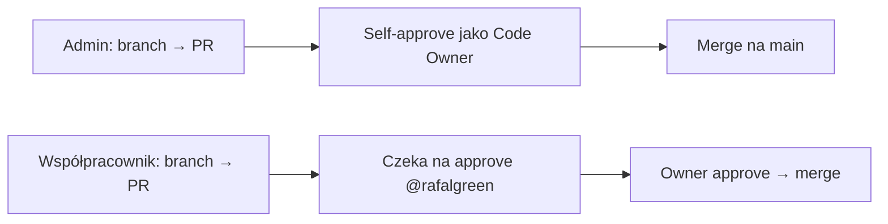

# Ochrona gałęzi `main` na GitHubie

Repozytorium: **rafalgreen/trading_analyser**  
Domyślna gałąź: **`main`** (potwierdzone przez `git remote show origin` → `HEAD branch: main`).

## Rekomendacja: klasyczna reguła (Branch protection rule)

Dla prostego przypadku (jedna gałąź `main`, blokada force push i usuwania) użyj **klasycznej reguły**, nie rulesetów.

### Kroki w UI GitHub (2026)

1. Otwórz repozytorium: https://github.com/rafalgreen/trading_analyser  
2. **Settings** → w lewym menu **Branches** (sekcja „Code and automation”).  
3. W sekcji **Branch protection rules** kliknij **Add rule** (lub **Add branch protection rule**).  
   - Jeśli widzisz tylko **Rulesets**, przełącz się na zakładkę / link **Branch protection rules** (klasyczne reguły) albo wybierz **Add classic branch protection rule**.
4. W polu **Branch name pattern** wpisz dokładnie:

   ```
   main
   ```

   - To **nie** jest glob typu `main/*` ani `*/main`.
   - Nie używaj `master`, jeśli domyślna gałąź to `main`.
   - Nie wpisuj samego `*` — chroni to wszystkie gałęzie i łatwo o pomyłkę.

5. Zaznacz co najmniej:
   - **Block force pushes**
   - **Block deletions**

6. Opcjonalnie (jeśli nie potrzebujesz review/CI na start):
   - **Require a pull request before merging** — odznaczone
   - **Require status checks to pass** — odznaczone

7. Kliknij **Create** / **Save changes**.

Po zapisaniu reguła powinna pojawić się na liście jako pattern **`main`**.

---

## Admin vs współpracownicy

Model uprawnień i review dla **rafalgreen/trading_analyser**:

| Rola w repo | Uprawnienia GitHub | Review / merge |
|-------------|-------------------|----------------|
| **Właściciel (admin)** — `@rafalgreen` | **Admin** | Może **sam zatwierdzić** własny PR i zmergować na `main` (Code Owner + autor). |
| **Współpracownik** | **Write** (nie Admin) | PR wymaga **zatwierdzenia od Code Ownera** (`@rafalgreen`); sam nie może zatwierdzić własnego PR jako wystarczającego review. |

### Plik CODEOWNERS

W repozytorium jest plik [`.github/CODEOWNERS`](../.github/CODEOWNERS):

```
# All changes require review from repository owner
* @rafalgreen
```

Wzorzec `*` oznacza, że **każda zmiana** w repo wymaga review od właściciela. GitHub automatycznie przypisuje `@rafalgreen` jako wymaganego recenzenta na PR.

### Reguła gałęzi `main` — zalecane checkboxy

W **Settings** → **Branches** → edytuj regułę dla **`main`** (lub utwórz nową) i włącz:

| Cel | Nazwa w UI |
|-----|------------|
| Wymuszenie PR | **Require a pull request before merging** |
| Jedno zatwierdzenie | **Require approvals** = **1** |
| Review od Code Ownera | **Require review from Code Owners** |
| Admin może zatwierdzić własny PR | **Allow authors to approve their own pull requests** — **zaznaczone** |
| Brak bypass dla współpracowników | **Do not allow bypassing the above settings** — współpracownicy (Write) nie mogą omijać reguł; admin merge po własnym approve jako Code Owner |
| Blokada force push | **Block force pushes** |
| Blokada usuwania | **Block deletions** |

**Uwaga:** **Do not allow bypassing the above settings** blokuje omijanie reguł przez osoby bez uprawnień admina. Właściciel repo (Admin) może nadal merge’ować PR po własnym approve — to zamierzony workflow dla admina.

### Zaproszenie współpracowników

1. **Settings** → **Collaborators** (lub **Manage access**).  
2. Dodaj użytkownika z rolą **Write** — **nie** **Admin**.  
3. Współpracownik tworzy branch → PR → czeka na **Approve** od `@rafalgreen` → merge.

### Workflow



- **Admin (`@rafalgreen`):** `git checkout -b feature/...` → commit → push → PR → **Approve** własnego PR → **Merge**.  
- **Współpracownik (Write):** ten sam flow, ale merge możliwy dopiero po **Approve** od Code Ownera.

### Rulesets — opcjonalna lista bypass tylko dla adminów

Jeśli używasz **Rulesets** zamiast klasycznej reguły:

1. **Settings** → **Rules** → **Rulesets** → edytuj ruleset dla **`main`**.  
2. Włącz te same reguły co wyżej (PR, 1 approval, Code Owners, block force push/deletions).  
3. W **Bypass list** / **Grant bypass permissions** możesz dodać **tylko** konto admina (`@rafalgreen`) lub rolę **Admin** — wtedy admin może w razie potrzeby ominąć reguły; **współpracownicy (Write) nie powinni być na liście bypass**.  
4. Dla współpracowników bez bypass: PR + approve Code Ownera pozostaje obowiązkowy.

---

## Blokada także dla administratorów

**Tak — można zablokować nawet admina repo**, żeby nie mógł pushować bezpośrednio na `main` i musiał iść przez PR.

### Dlaczego ostatni push mimo reguły się udał?

Obecna reguła (od 2026-05-23) blokuje głównie **force push** i **usuwanie** gałęzi. **Nie wymusza PR** i domyślnie **administratorzy mogą omijać** (bypass) reguły ochrony gałęzi. Jeśli push na `main` przeszedł mimo włączonej ochrony, najczęściej:

1. konto ma rolę **Admin** w repozytorium, **oraz**
2. **nie** jest zaznaczone **Do not allow bypassing the above settings** (w starszym UI: **Include administrators** — ta sama funkcja, odwrotna logika nazwy).

Same **Block force pushes** / **Block deletions** **nie** blokują zwykłego `git push origin main`.

### Klasyczna reguła — wymuszenie PR + brak bypass dla admina

1. **Settings** → **Branches** → edytuj regułę dla **`main`** (lub utwórz nową).
2. Włącz:
   - **Require a pull request before merging**
     - opcjonalnie: **Require approvals** = `0` (wystarczy otwarty PR, bez review od drugiej osoby)
   - **Block force pushes**
   - **Block deletions**
   - **Do not allow bypassing the above settings** ← **kluczowe dla adminów**
3. Zapisz (**Save changes**).

**Dokładne nazwy checkboxów w UI GitHub (2026):**

| Cel | Nazwa w UI |
|-----|------------|
| Wymuszenie PR | **Require a pull request before merging** |
| Admin też podlega regułom | **Do not allow bypassing the above settings** |
| (starsze UI / API) | **Include administrators** — to samo co powyżej, przez API: `enforce_admins: true` |
| Blokada force push | **Block force pushes** |
| Blokada usuwania | **Block deletions** |

Po włączeniu **Do not allow bypassing the above settings** administrator **nie może** zrobić zwykłego pusha na `main` — musi branch feature → PR → merge.

### Rulesets — jeśli używasz rulesetów zamiast klasycznej reguły

1. **Settings** → **Rules** → **Rulesets** → edytuj ruleset obejmujący **`main`**.
2. Włącz:
   - **Require a pull request before merging**
   - **Block force pushes**
   - **Block branch deletions**
   - (opcjonalnie) **Restrict updates** — tylko osoby z bypass mogą pushować na chronioną gałąź
3. W sekcji **Bypass list** / **Grant bypass permissions**:
   - **zostaw listę pustą** — nie dodawaj roli **Admin**, użytkowników ani teamów
   - jeśli ktoś jest na liście bypass, może omijać reguły mimo PR
4. Upewnij się, że ruleset jest **Active** i targetuje **`main`**.

### Weryfikacja (po zmianie ustawień)

```bash
# lokalnie — powinno się nie udać (403 / GH006)
git checkout main
echo "test" >> README.md && git commit -am "test direct push"
git push origin main
```

Oczekiwany wynik: odrzucenie pusha, np. `remote: error: GH006: Protected branch update failed` lub HTTP **403**.

Sprawdzenie przez API (gdy masz `gh`):

```bash
gh api repos/rafalgreen/trading_analyser/branches/main/protection
# enforce_admins.enabled powinno być true
# required_pull_request_reviews powinno być ustawione
```

---

## Alternatywa: Rulesets

Jeśli organizacja wymusza **Rulesets** zamiast klasycznych reguł:

1. **Settings** → **Rules** → **Rulesets** → **New ruleset** → **New branch ruleset**.  
2. **Target branches**: wybierz **Include default branch** albo ręcznie dodaj gałąź **`main`**.  
3. Włącz:
   - **Block force pushes**
   - **Block branch deletions**
4. Zapisz ruleset i upewnij się, że status rulesetu to **Active** i obejmuje **`main`**.

---

## Typowe błędy („Branch name pattern nie działa”)

| Błąd | Poprawnie |
|------|-----------|
| `main/*` | `main` |
| `*/main` | `main` |
| `*` (wszystkie gałęzie) | `main` |
| `master` przy domyślnej gałęzi `main` | `main` |
| Ruleset bez „Include default branch” / bez targetu `main` | Cel: domyślna gałąź lub `main` |
| Edycja rulesetu w innym repo / fork | Otwórz **rafalgreen/trading_analyser** |
| Brak uprawnień admina | Potrzebne uprawnienia **Admin** do repo |

---

## Weryfikacja

- **Settings** → **Branches**: reguła z patternem **`main`** i zielonym statusem.  
- Próba force push na `main` powinna zostać odrzucona przez GitHub.

## API (gdy masz `gh`)

> **Uwaga:** `gh` nie było dostępne w środowisku deweloperskim przy aktualizacji tej dokumentacji — poniższe komendy uruchom lokalnie po `gh auth login`.

### Tylko force push / deletions (admin może omijać)

```bash
gh api repos/rafalgreen/trading_analyser/branches/main/protection -X PUT \
  --input - <<'EOF'
{
  "required_status_checks": null,
  "enforce_admins": false,
  "required_pull_request_reviews": null,
  "restrictions": null,
  "allow_force_pushes": false,
  "allow_deletions": false
}
EOF
```

### PR wymagany + admin **bez** bypass (zalecane)

`enforce_admins: true` = w API to samo co **Do not allow bypassing the above settings** w UI.

```bash
gh api repos/rafalgreen/trading_analyser/branches/main/protection -X PUT \
  --input - <<'EOF'
{
  "required_status_checks": null,
  "enforce_admins": true,
  "required_pull_request_reviews": {
    "dismiss_stale_reviews": false,
    "require_code_owner_reviews": false,
    "require_last_push_approval": false,
    "required_approving_review_count": 0
  },
  "restrictions": null,
  "allow_force_pushes": false,
  "allow_deletions": false
}
EOF
```

Wymaga zainstalowanego [GitHub CLI](https://cli.github.com/) i `gh auth login`.

## Status

Reguła aktywna od 2026-05-23 (force push + deletions). Plik **CODEOWNERS** (`* @rafalgreen`) wymaga review właściciela na każdy PR. Pełny workflow admin vs współpracownicy: sekcja **Admin vs współpracownicy**. Aby wymusić PR dla wszystkich, włącz ustawienia z sekcji **Blokada także dla administratorów**.
